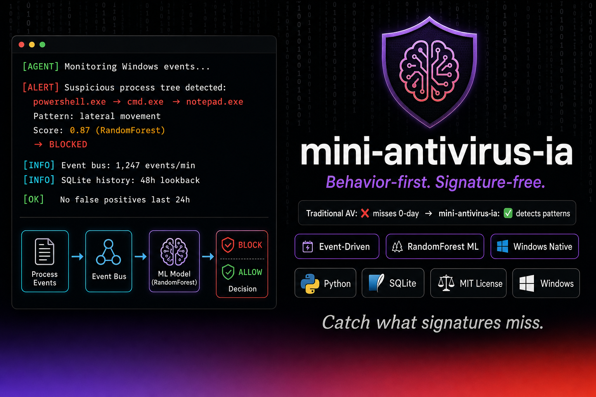
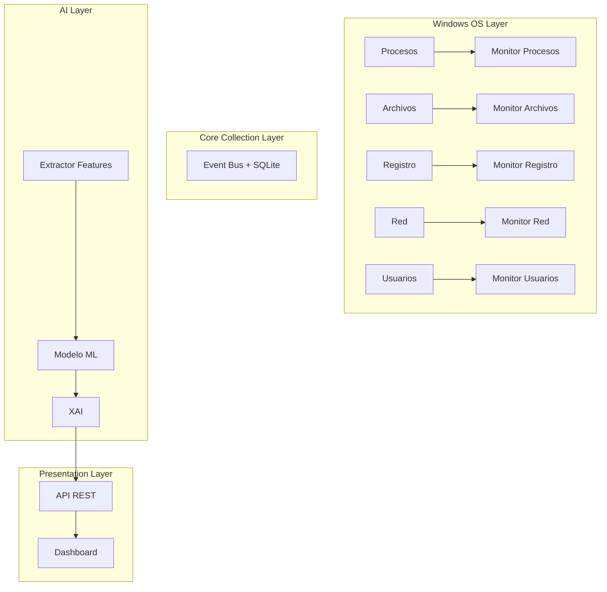

# mini-antivirus-ia

[](LICENSE)
[](https://python.org)
[](#)
[](#)


**Catch what signatures miss.**

Sistema de vigilancia y detección de comportamiento malicioso para Windows, basado en IA y arquitectura event-driven.

---

## 🚀 Visión

Los antivirus tradicionales dependen de firmas; resultan ineficaces ante malware polimórfico y ataques Zero-Day.  MiniAntivirus-IA adopta una **estrategia de vigilancia activa**:

1. **Agente ligero** que recopila eventos críticos del sistema (procesos, archivos, registro, red…).
2. **Event Bus** desacoplado que distribuye los eventos y los persiste en SQLite para análisis histórico.
3. **Modelo ML** (baseline RandomForest, ampliable a transformers) que clasifica comportamientos sospechosos.
4. **Logs estructurados** con `structlog` para trazabilidad y fácil ingesta en SIEMs.

Este enfoque centrado en comportamiento y aprendizaje continuo permite detectar amenazas inéditas, reducir falsos positivos y escalar funcionalidades sin re-escribir el núcleo.

---

## 🖼️ Arquitectura



---

## 📂 Estructura de Carpetas

```
src/
├── agent/               # Recolección de eventos
│   ├── collectors/      # Monitores (procesos, archivos…)
│   └── utils/           # Event Bus, store, logging
├── analyzer/            # Modelos y features
├── api/                 # FastAPI (pendiente)
├── ui/                  # Vue.js (pendiente)
└── tests/               # Pytest
```

---

## ⚙️ Instalación Rápida

```bash
# 1. Clonar repositorio
$ git clone https://github.com/usuario/miniantivirus-ia.git
$ cd miniantivirus-ia

# 2. Crear y activar entorno (Windows)
$ python -m venv venv
$ .\venv\Scripts\activate

# 3. Instalar Poetry y dependencias
(venv)$ pip install poetry
(venv)$ poetry install

# 4. Configurar variables de entorno
(venv)$ copy env.example .env  # o establezca manualmente LOG_LEVEL, EVENT_DB_PATH
```

---

## 💻 Uso Básico

```python
from src.agent.utils.logger_config import setup_logging
from src.agent.utils.event_bus import EventBus
from src.agent.utils.event_store import SQLiteEventStore
from src.agent.collectors.process_monitor import ProcessMonitor

setup_logging()
store = SQLiteEventStore("events.db")
bus = EventBus(store=store)

bus.subscribe("process_created", lambda e: print("Nuevo proceso:", e.payload))

monitor = ProcessMonitor(bus)
monitor.start()

# Mantener hilo principal vivo
time.sleep(60)
```

---

## 🧩 Features

- Arquitectura **event-driven** con persistencia ligera.
- **Logs JSON** listos para SIEM/ELK.
- **Modularidad**: añadir nuevos monitores o modelos sin tocar el core.
- **XAI** (explainability) preparada para futuras versiones.
- **Tests** automatizados con Pytest.

---

## 📝 Roadmap Resumido

- [ ] Baseline ML de detección de procesos
- [ ] API REST `/events` y `/alerts`
- [ ] Dashboard Vue.js
- [ ] Monitores de red y archivos

---

## 🤝 Contribuir

Las PRs son bienvenidas.  Antes de enviar, ejecuta:

```bash
(venv)$ pre-commit run --all-files
(venv)$ pytest
```

---

## 📄 Licencia

MIT © 2025 drhiidden 
---

## Metodología

Desarrollado con [HCP (Human-Code-AI Protocol)](https://github.com/haletheia/human-code-ai-protocol) — protocolo git-native para Context Engineering.
